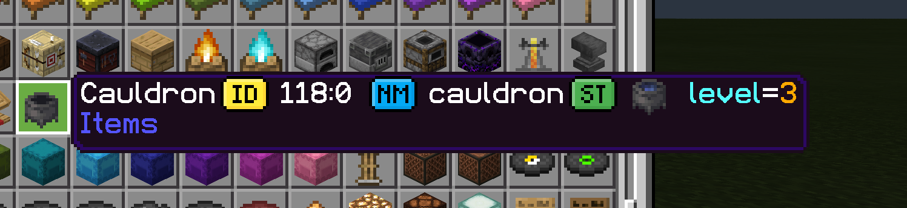

## Why would i use this?

Bedrock IDs and Namespaces differ quite a lot from the Java Version.
This makes it somewhat hard or annoying to build on cross-play servers that use the Java IDs internally.

To help me (any maybe you) with that issue, i created a small package that can generate a modified version of any language you want

 

---

 

## Modifying .lang Files

### Install

- Install Nodejs 14.2+
- Download this branch and open it in the explorer
- Run `npm i` in the extracted project folder to install the dependencies

### Use

- Create a folder called `input` in the root directory
- Paste all the .lang files you want to modify into that folder
- Run `npm t` to start the modification
- Zip the `PaperID vx.x.x` Folder that you will get in the root directory
- Change the file ending to .mcpack instead of .zip

### Ingame

- Once you imported the pack, activate it
- Let it load
- Select a modified language of your choice from the menu

 
 

### I just need the latest en_US version

The latest release is always bundled with a `PaperID.mcpack` that is already modified.
If en_US is all you need, then you can just download the pack

 

---

 

## Credits

##### Crediting us

- The GPL 3.0 License applies in every aspect.
- If you share the pack or a generated Version of it, you have to give the credit according to the License
  which clearly informs the users about it. E.g. a link to this Repository.
